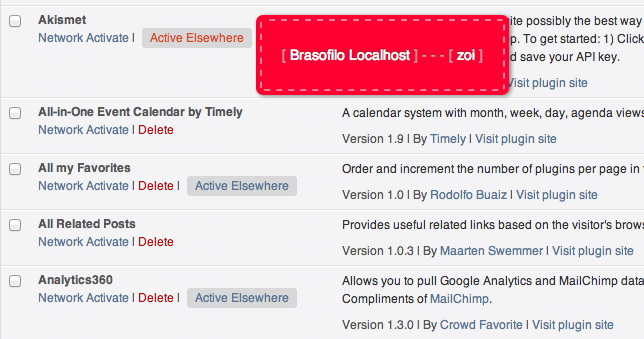
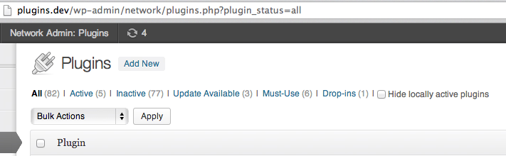

# [Network Deactivated but Active Elsewhere](https://github.com/brasofilo/Network-Deactivated-but-Active-Elsewhere)
*Version 2013.10.13*

*Inserts an indicator in the Network Plugins page 
whether a plugin is being used by any blog of the network.  
Shows the list of blogs on rollover.*

There are cases where a Network activated plugin also shows 
the <kbd>Active Elsewhere</kbd> button.  
That's because the plugin was active prior to Network activation 
-and if it's Network deactivated, it's still active in that site.

----
***IN ACTION***  

----
* In the screens All and Inactive, a switch to show/hide the NDBAE plugins.    
* Please, note that the switch only appears when All is explicitly clicked (`plugin_status=all`).  

## Changelog

Version 2013.10.13
* Changed version numbering
* Added GitHub updater

Version 1.2
* Small adjustments

Version 1.1  
* Added switch to show/hide the NDBAE plugins

Version 1.0  
* Plugin launch

## Credits
 - Plugin skeleton from [Plugin Class Demo](https://gist.github.com/3804204), by toscho. 

## Licence
Released under GPL, you can use it free of charge on your personal or commercial blog.